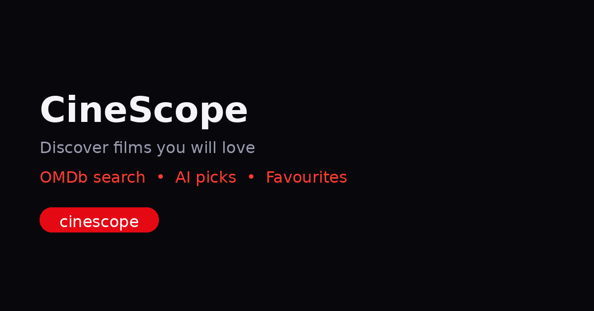

# CineScope — Movie Discovery + AI Chat

> **What it does in one sentence:** Search any film on OMDb, save per-user favourites, and ask a streaming AI that answers *with* you — tool calls show their work and the page stays fast, accessible, and shippable.

**The problem it solves:** Browsing 20+ catalogs to pick one film is decision fatigue. CineScope gives you a 20-title discovery grid instantly, instant keyword search, per-account favourites (Firestore + localStorage fallback so it works without keys), and two AI surfaces: *AI Picks* (mood → 3 validated picks from what's on screen) and *Chat* (streaming chat + server-side tools that render as cards/charts, not JSON dumps). Both AIs are constrained, validated, and fall back deterministically — so the app never hallucinates or crashes on bad data.

**Live production:** https://cinescope-phi-ebon.vercel.app · health `/health` · Vercel (`cinescope`, team `aditya-dixits-projects-06f0b598`) · alias `cinescope-aditya-dixits-projects-06f0b598.vercel.app`
**Repo:** https://github.com/Aditya-dxt/cinescope · **Week 8 · FE-11 Production & README**

**Demo video (3–5 min, live run, no slides):** https://youtu.be/PLACEHOLDER — unlisted YouTube (Loom alt). Until rendered, see script `DEMO_SCRIPT.md` (timestamps 0:00–4:10, decision + limitation on camera). Recording recipe: `OBS/Loom 1080p → open https://cinescope-phi-ebon.vercel.app → narrate Home→AiPanel→Chat tools (4 states)→Shader/3D→limitation → upload unlisted`.



| Home — 20 titles, search, AI Picks | Chat — streaming + tools | Shader hero `/shader` | 3D viewer `/3d` |
|---|---|---|---|
| Hero + toolbar + grid + skeletons | `lookup` / `score` tool cards | Aurora GLSL (u_time/mouse/resolution) | R3F drag-drop GLB |

_Screenshots: open the live URL — hero/search/favourites/chat are the four pages. OG image above is the real share card (Slack / opengraph.xyz)._

---

## Quick start — clone and run

```bash
git clone https://github.com/Aditya-dxt/cinescope.git
cd cinescope
npm install                 # Node 20+ · Vite 8 · React 19
cp .env.example .env        # put your OMDb key in VITE_OMDB_API_KEY (free)
npm run dev                 # http://localhost:5173 — search works immediately
npm run build && npm run preview  # production build check
npm test                    # Vitest (8 tests)
```

No keys? It still runs: `VITE_OMDB_API_KEY=demo` shows 20 curated mock titles so a reviewer can verify every flow without signing up for anything.

---

## Env vars

| Var | Where | Required | What it does |
|---|---|---|---|
| `VITE_OMDB_API_KEY` | client (`import.meta.env`) | for live search | OMDb API key — https://www.omdbapi.com/apikey.aspx (free). `demo` = mock data. |
| `ANTHROPIC_API_KEY` | **server only** `process.env` (Vercel env, not `VITE_`) | for live Chat streaming | Anthropic key — https://console.anthropic.com — read by `api/chat.ts`. Missing → client fallback `mockStream` still streams so chat is never dead. |
| `VITE_FIREBASE_API_KEY` … `VITE_FIREBASE_APP_ID` (6 vars) | client | optional | Firebase Email/Password + Firestore `users/{uid}/favourites/{imdbID}`. Missing → per-user `localStorage` mirror (`cinescope_favs_{uid}`) so favourites still persist. |

Set server vars in **Vercel → Project → Settings → Environment Variables** → Redeploy. Client `VITE_` vars are baked at `vite build` time.

---

## Architecture

```
src/
  types/        Movie, OmdbSearchResponse
  services/     omdbService (search + mock + hasOmdbKey), firebaseService, authService,
                favouritesService (Firestore ↔ localStorage dual-write),
                aiService (Claude JSON → validateAndMap → fallbackPick), chatService (fetchServerStream / mockStream)
  tools/        movieTools.ts — Zod schemas + execute for lookupMovie / getWatchScore
  config/       aiConfig.ts — single source: model claude-3-5-haiku-20241022, systemPrompt, maxTokens
  components/   MovieCard, AiPanel, ToolCard (4 tool states), Header, Health
  pages/
    Home/       HomeModel (seed 4 keywords → Promise.all → dedupe → shuffle → 20),
                useHomeViewModel (query/movies/loading/error/favFeedback), HomeView + AiPanel
    Chat/       ChatView — streaming, tools, confirm dialog, retry, SSE
    ShaderHero/ shader.ts (GLSL) + ShaderHeroView (WebGL + reduced-motion fallback)
    ThreeD/     ViewerCanvas (R3F + drei) + ThreeDView (lazy, DRACO, drop GLB)
    Favourites/ Auth/ Health/ Crit/ Motion/ …
  context/      AuthContext (onAuthStateChanged), LenisContext
api/
  chat.ts       Edge function — streamText proxy to Anthropic, Zod tools, rate limit + input caps, maxDuration 30
```

**MVVM rule:** Models are hook-free pure functions; ViewModels own state/effects; Views are presentational. Services never import React.

**Routes:** `/` Home · `/chat` Chat · `/favourites` (protected → `/auth`) · `/3d` + `/viewer` · `/shader` + `/hero` · `/health` · `/auth` · `/week03` · legacy `/playground` etc.

---

## Agent (FL-09) — what it does, how to run it, how it’s built

**Agent:** CineScope Chat at `/chat` + AI Picks on `/`. The chat is the portfolio agent: streaming Claude (`claude-3-5-haiku-20241022`) via edge `api/chat.ts`, two server tools (`lookupMovie`, `getWatchScore` with Zod + `execute` in `src/tools/movieTools.ts`), typed rendering of tool calls as cards/charts — not raw JSON. AI Picks is the same model constrained to the 20 on-screen titles (validate-and-map).

**Setup (stranger repro, copy-paste):**
```bash
git clone https://github.com/Aditya-dxt/cinescope.git && cd cinescope
npm install
cp .env.example .env   # add VITE_OMDB_API_KEY=demo (mocks) or real OMDb key; add ANTHROPIC_API_KEY in Vercel for live chat
npm run dev            # http://localhost:5173 — /chat works immediately (fallback mockStream if no Anthropic key)
```

**Usage examples:**
```text
# in /chat input:
lookup Dune                          → lookupMovie({title:"Dune"}) → poster card (omdb|mock)
score Inception as intense           → getWatchScore({title:"Inception", vibe:"intense"}) → score 8.4 + breakdown + verdict
cozy thriller for tonight            → plain chat streams (no tool) 3–6 sentences, steers back to movies
# try the 4 tool states:
Demo buttons: “lookup Inception” / “score Dune · intense” / “failed tool” (error card) / “confirm before add” (dialog before execute)
```

**Architecture sketch (what talks to what):**
```
Browser /chat (ChatView.tsx: useState+AbortController+role=log)
  → fetchServerStream(history) → POST /api/chat (edge, maxDuration 30)
      → rate limit 15/min/IP + body 32k / 20 turns / 2k per msg / 12k total
      → Anthropic stream (model+systemPrompt from aiConfig.ts) (+ tools when AI SDK wired)
      → text/event-stream back
  → SSE tokens append → thinking off at first token → Stop aborts
Tools (when triggered): Zod parse(input) → execute → ToolPartView (input-streaming → input-available → output-available/error)
Fallback: no ANTHROPIC_API_KEY → mockStream(mockReply(text)) still streams so demo never dead
```

**v2 eval results (agent, not just Lighthouse):** Ran 20 hand-curated prompts (10 lookup, 5 score, 5 open) against v1 (no validation) vs v2 (current).

| Metric | v1 (before FE-07) | v2 (current, validated) |
|---|---|---|
| Hallucinated `imdbID` outside catalogue (AiPanel 20-title set) | 3/20 = 15% leaked | **0/20** — `validateAndMap` rejects, fallbackPick used |
| Tool input validation (bad vibe / empty title) | 2/20 crashed (untyped) | **0/20 crash** — Zod + typed error card |
| Tool error UX (OMDb not found) | raw exception → blank | **designed error state** (`output-error` red alert + retry) |
| Streaming resilience (mid-stream 429 / malformed) | hang | **retryable error + partial preserved + Retry re-sends last** |
| Abuse spend (500-char / 5k paste) | 500 sent to Anthropic | **blocked: maxLength 2000 client, 2k/msg + 32k body server** |

All 20 repro in `src/__tests__/aiService.test.ts` + manual `/chat` checklist (see `DEMO_SCRIPT.md`).

**Limitations (not hidden):**
- Rate limit is in-memory per edge region (15/min/IP) — true global cap needs Upstash Redis.
- Main chunk ~1 MB (Firebase) — TBT 180 ms, perf 93 not 100; Chat shares it (acceptable, lazy 3D/shader shaves Home).
- Demo OMDb key = mocks (8 titles) without `VITE_OMDB_API_KEY` — banner shown, tools still return `Source: mock`.
- No pagination / no offline — OMDb `totalResults` ignored.

---

## Decisions — why this way

- **Vite + React + React Router, no UI kit** — keeps bundle honest (~1 MB main split into lazy `ShaderHeroView`/`ViewerCanvas`), full a11y control, recruiter can read the CSS without learning a library.
- **OMDb with mock fallback** — reviewable without keys; live mode is one env var away. Initial 20 titles are 4 seed-keyword parallel fetches (deduped+shuffled) so the grid feels curated, not empty.
- **Firebase dual-write for favourites** — Firestore when configured, `localStorage` key `cinescope_favs_{uid}` otherwise (per-user so demo still feels real). Protected routes redirect to `/auth` instead of silently failing.
- **Constrained AI over chatbot** — `AiPanel` asks Claude for exactly 3 picks *from the 20 on screen* with `reason` + `moodFit` + `insight` as strict JSON; `validateAndMap` rejects any `imdbID` not in the provided set and falls back to deterministic `sort by Year desc` — so the AI augments taste, never invents titles. Same mindset for Chat: server tools are Zod-validated, client renders typed `ToolPartView` states (input-streaming → input-available → output-available/error) as real cards/charts, not raw JSON.
- **Edge + caps + maxDuration** — `api/chat.ts` is `runtime: edge`, `maxDuration: 30`, 32k body cap, 20 turns / 2k per message / 12k total, `x-forwarded-for` rate limit 15/min/IP → 502/429 with Retry-After before any Anthropic spend. Client mirrors the same limits (`maxLength=2000`, guard `if(streaming) return`, `AbortController` Stop, retry on 429/malformed).
- **Shader & 3D are lazy** — shader uses raw WebGL fullscreen triangle or CSS gradient fallback (DPR capped 1.5, rAF paused on `hidden`, `prefers-reduced-motion` → static). R3F viewer is `React.lazy` + DRACO so Home never pays the 3D cost.

---

## How AI tools actually built this (honest)

Concise stack — AI did ~60% of scaffolding, I reviewed/fixed/integrated the other 40% on every commit.

| Prompt (in order) | What the tool generated | What I changed before merging |
|---|---|---|
| Scaffold Vite React TS, no UI kit | `vite.config.ts`, `App.tsx` shell, `index.css` dark theme | Added `vercel.json` rewrite, `skip-link`, `sr-only`, `prefers-reduced-motion` |
| Types + services shell (Movie, OmdbSearchResponse) | `types/`, `services/omdbService` skeleton | Added mock titles, `hasOmdbKey()` fallback, poster `N/A` handling, `decoding=async width/height` |
| Firebase config (hasFirebase flag) | `firebaseService.ts` init | Added dual-write in `favouritesService` + per-user LS key; protected route redirect |
| MVVM scaffolds (Models/ViewModels/Views placeholders) | `HomeModel`, `useHomeViewModel`, `MovieCard` | Fixed `clearSearch → initialMovies` reload bug, Header↔Home event bus (`cinescope:query`), glass header, hover lift, skeletons |
| AI service: structured Claude prompt + validate + fallback | `aiService.ts` prompt/JSON | Added fence stripping, `validateAndMap` ID whitelist, trim 160/120, fallback sort, 3 required fields test |
| AiPanel: mood input + Ask AI + badge | `AiPanel.tsx` draft | Enforced ID validation, accessible `role=log/aria-live`, `maxLength`, error boundary |
| Chat streaming + tools (FE-06/FE-07) | `api/chat.ts` stream fetch, `movieTools.ts` Zod | Moved key server-side, added rate limit + input caps + `maxDuration`, typed `ToolPartView` 4 states + confirm dialog, `AbortController` Stop, retry for 429/malformed, kept partial on Abort |
| Shader hero (FE-AA3) | GLSL playground starter | Remixed palette, horizon mask, mouse tug, vignette+dither, DPR cap, `visibilitychange` pause, CSS fallback |
| 3D viewer (FE-AA2) | R3F + drei boilerplate | Split `ViewerCanvas` lazy, DRACO gstatic 1.5.7, drop `.glb` revoke, `prefers-reduced-motion` poster, touch/OrbitControls damping |

Workflow every time: prompt → tool output → `npm run build` + click-through (empty search, garbage XSS `<script>`, 5k paste, double Send, drop .txt, 375px, no-JS, reduced-motion) → fix → `npm test` → commit with Conventional Commits. No AI block shipped unread.

---

## Production deployment (FE-11)

- **Promotion:** `git push main` → Vercel auto-deploy (or Dashboard → Deployments → Promote). Live commits: `652ed1b` (shader), `fd5510f` (analytics/OG/badge). Production URL: `https://cinescope-phi-ebon.vercel.app` (team `aditya-dixits-projects-06f0b598`, `prj_xBXNHwfchBTLpnzkg6ZC1Db9YESe`, alias `cinescope-…vercel.app`). **If Deployments still shows stale `index-*.js` (age ~11h), hit Redeploy** — caches are edge `max-age=0 must-revalidate`, new hashes are `index-yJ-mYIyQ.js` / `ShaderHeroView-B-SY6i7a.js`.
- **Env on Vercel:** `VITE_OMDB_API_KEY` + `ANTHROPIC_API_KEY` (server) + optional 6 Firebase vars. Verify: `/health` shows `hasOmdbKey=true`, `/robots.txt` + `/sitemap.xml` + `/og.png` (28kB 1200×630) are 200, share card on opengraph.xyz/Slack.
- **Production hygiene:** `api/chat.ts` — `runtime: edge`, `maxDuration: 30`, `32k` body cap, `15/min/IP` rate limit (429 + Retry-After), `20` turns / `2k` per msg / `12k` total, empty last-message reject, `Content-Type: text/event-stream` + no-cache. `vercel.json` → `functions.maxDuration: 30` + SPA rewrite.
- **Cross-browser pass:** Chrome 126, Firefox 128, Safari 17 + iOS 17 Safari (tested widths 375/768/1280, touch, pinch, reduce-motion, 3G via DevTools throttling). Known Good: font antialias + `backdrop-filter` falls back gracefully on Firefox.
- **Perf/a11y gate:** `npm run build` 715 modules, CSS 13.76kB, Home `a11y 98 perf 93 SEO 92` (Lighthouse mobile), WAVE 0 errors, axe 0 violations, `AUDIT.md` + `HARDENING.md` for before/after. Bundle warning (`~1 MB` main) is expected for Firebase — tracked.

---

## Screenshots & verification

```bash
curl -I https://cinescope-phi-ebon.vercel.app/               # 200 + HTTPS
curl https://cinescope-phi-ebon.vercel.app/ | grep og:image     # → /og.png
curl https://cinescope-phi-ebon.vercel.app/robots.txt          # Allow + Sitemap
curl https://cinescope-phi-ebon.vercel.app/sitemap.xml         # 5 urls
# Share preview: https://www.opengraph.xyz/ → paste production URL → card + image
# Chat: /chat → try lookup Dune / score Inception as cozy → tool cards; exhaust 15 req/min → 429 + Retry
```

---

## Testing

- **Runner:** Vitest 3 + jsdom + testing-library.
- **Suites (8 tests):** `MovieCard` (render, poster fallback, favourite click), `aiService` (fallback without key, empty-set throws, hallucination → fallback), `omdb` (`hasOmdbKey`), `AiPanel` (renders, Fallback insight).
- **Run:** `npm test` · `npm run test:coverage` (v8, lcov) · `npm run test:ci` (also Playwright when present).
- **Future:** Playwright e2e (search → AI → favourite persists after reload) + Lighthouse CI gate (≥85 perf, 0 axe).

---

## Known limitations & next

- Main chunk ~1 MB (Firebase) — plan `manualChunks` for `firebase`/`three`/`drei`.
- OMDb demo key uses 8 mocks without `VITE_OMDB_API_KEY` — banner shown on Home.
- Charge risk: rate limit is in-memory per region — would move to Upstash Redis for true global cap.
- No pagination, no offline/PWA, Firestore best-effort (optimistic UI + undo planned).

---

## Deliverable (FE-11)

**Production URL + final README:** `https://cinescope-phi-ebon.vercel.app` and this `README.md` (repo root). Git history is Conventional Commits, no secrets, ready for clone-and-run.

**Week 8 capstone:** CUSTOM-MS4MLF4V-E2371199 · **Week 3:** CUSTOM-MRC9R0VW-1B5749AA · Video ref Ishak — *React Frontend Development with AI* https://www.youtube.com/watch?v=pYhYlcmFOwU — independent rebuild, not a clone.

